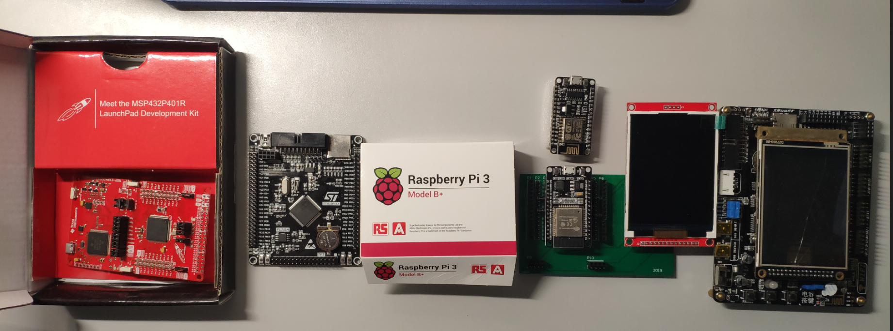

# 使用MicroPython打造电赛效率开发利器

*所有文件为本组赛前及赛中准备中所作，如有特殊或其他需要，可联系作者qq 978020607*

## 固件(MicroPython)
- esp32 
 含软串口，感谢大佬提供@junhuanchen
- stm32f407vet6 (Black Board)
 支持多线程、板载sd卡的基础固件版本，以及附加支持w5500模块以太网通信固件版本
- stm32f407zgt6
支持多线程、板载sd卡的基础固件版本，以及附加支持w5500模块以太网通信固件版本

## 模块驱动(MicroPython)
常见模块驱动，主要为信号组相关，其他驱动可以联系作者单独制定，有自己做好的也欢迎联系作者加入进来
- DDS信号发生器
   含AD9959驱动、AD9851驱动

- PLL锁相环
   ADF4351驱动

- 程控衰减器(例子)

- 外置sd模块

- w5500通信（需使用w5500版本固件）

- 矩阵键盘（外接iic扩展模块+矩阵键盘）

- 

   | 显示相关                                                     |
   | :----------------------------------------------------------- |
   | 使用ILI9341的3.2寸TFT显示屏驱动                              |
   | 使用串口屏（本人采用大彩串口屏，已封装好常见功能，若有其他需要可仿写或联系） |

  

  

  

  

  

  

  

  

